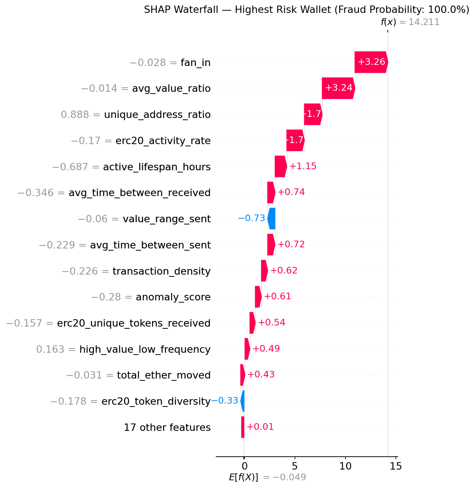
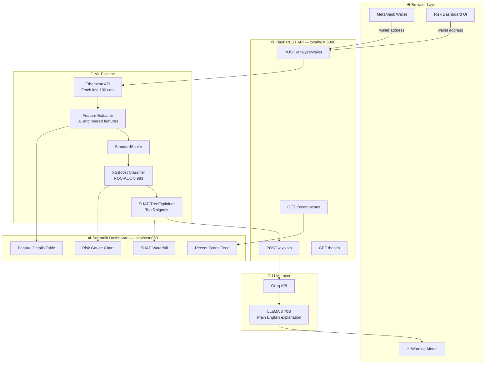

# 🔗 On-Chain Fraud Intelligence Network

<div align="center">

[](https://python.org)
[](https://xgboost.readthedocs.io)
[](https://flask.palletsprojects.com)
[](https://on-chain-fraud-intel.streamlit.app)
[](https://console.groq.com)
[](LICENSE)

<br/>

**Real-time Ethereum wallet fraud detection powered by XGBoost + SHAP explainability,**  
**MetaMask browser integration, and plain-English AI explanations via LLaMA 3 70B.**

<br/>

[🚀 Live Demo](https://on-chain-fraud-intel.streamlit.app) · [📖 Documentation](#-how-it-works) · [🐛 Report Bug](https://github.com/LeGiON-055/on-chain-fraud-intelligence/issues) · [⭐ Star this repo](https://github.com/LeGiON-055/on-chain-fraud-intelligence)

<br/>

> 💡 **Crypto fraud cost users $3.9 billion in 2023.** This system detects fraudulent  
> Ethereum wallets in real time — before you send a single transaction.

</div>

---

## 📸 Screenshots

| Risk Dashboard | SHAP Explainability | LLM Explanation |
|:-:|:-:|:-:|
|  |  |  |

---

## ✨ Features

- **⚡ Real-time wallet scanning** — Paste any Ethereum address and get a fraud risk score in under 2 seconds
- **🧠 31 engineered features** — Transaction velocity, fan-in/out ratio, ERC20 patterns, temporal behavior, and more
- **🌲 XGBoost classifier** — Trained on 9,800+ wallets with **ROC-AUC of 0.983**, crushing the 0.95 target
- **💡 SHAP explainability** — Every prediction comes with a waterfall chart showing *exactly* which features drove the score
- **🤖 LLaMA 3 70B explanations** — Groq API converts technical risk signals into plain English anyone can understand
- **🦊 MetaMask interception** — Warns you before sending ETH to a high-risk address, directly in your browser
- **📊 Live Streamlit dashboard** — Publicly accessible, no installation required for end users
- **🔗 REST API** — Clean Flask API with 3 endpoints ready for integration into any product

---

## 🏗 System Architecture



---

## 📊 Model Performance

| Metric | Score | Target |
|--------|-------|--------|
| **ROC-AUC** | **0.983** | ≥ 0.95 ✅ |
| Accuracy | 96% | — |
| Fraud Precision | 88% | — |
| Fraud Recall | 87% | — |
| F1-Score (Fraud) | 88% | — |
| 5-Fold CV ROC-AUC | 0.977 ± 0.010 | — |

**Training data:** 9,841 Ethereum wallets (77.9% legitimate, 22.1% fraud)  
**Class balancing:** SMOTE oversampling applied to training set only  
**Hyperparameter tuning:** GridSearchCV over 108 combinations, 5-fold StratifiedKFold

### Top 10 Features by SHAP Importance

| Rank | Feature | SHAP Value | What it captures |
|------|---------|-----------|-----------------|
| 1 | `unique_address_ratio` | 1.843 | Diversity of counterparties vs transaction volume |
| 2 | `active_lifespan_hours` | 1.352 | How long the wallet has been active |
| 3 | `erc20_activity_rate` | 0.997 | Token transaction frequency |
| 4 | `fan_in` | 0.961 | Number of unique senders to this wallet |
| 5 | `total_ether_moved` | 0.935 | Total ETH flowing through the wallet |
| 6 | `avg_value_ratio` | 0.741 | Ratio of average sent to received value |
| 7 | `avg_time_between_sent` | 0.672 | Timing regularity of outgoing transactions |
| 8 | `high_value_low_frequency` | 0.657 | Large transactions with low activity |
| 9 | `value_range_sent` | 0.653 | Spread between min and max sent values |
| 10 | `avg_time_between_received` | 0.652 | Timing regularity of incoming transactions |

---

## 🚀 Quick Start

### Prerequisites

- Python 3.10+
- Free API keys (see below)

### 1. Clone the repository

```bash
git clone https://github.com/LeGiON-055/on-chain-fraud-intelligence.git
cd on-chain-fraud-intelligence
```

### 2. Install dependencies

```bash
pip install -r requirements.txt
```

### 3. Set up API keys

```bash
cp .env.example .env
# Open .env and fill in your free API keys
```

| Service | Get your free key | Used for |
|---------|------------------|----------|
| **Etherscan** | [etherscan.io/apis](https://etherscan.io/apis) | Fetching live wallet transaction history |
| **Groq** | [console.groq.com](https://console.groq.com) | LLaMA 3 70B plain-English explanations |
| **Alchemy** | [alchemy.com](https://alchemy.com) | Ethereum node access |

### 4. Download the dataset and train the model

```bash
# Download Ethereum fraud dataset from Kaggle
# Place transaction_dataset.csv in data/raw/

# Run the full ML pipeline
python src/data_loader.py       # Clean and explore data
python src/feature_extractor.py # Engineer 31 features
python src/train_model.py       # Train XGBoost + generate SHAP plots
```

### 5. Start the Flask API

```bash
python api/app.py
# API running at http://localhost:5000
```

### 6. Launch the Streamlit dashboard

```bash
# In a new terminal
python -m streamlit run dashboard/app.py
# Dashboard at http://localhost:8501
```

---

## 🔌 API Reference

### `GET /health`

Health check endpoint.

```bash
curl http://localhost:5000/health
```

```json
{
  "status": "healthy",
  "model_loaded": true,
  "feature_count": 31,
  "version": "1.0.0"
}
```

---

### `POST /analyze/wallet`

Analyze any Ethereum wallet for fraud risk.

```bash
curl -X POST http://localhost:5000/analyze/wallet \
  -H "Content-Type: application/json" \
  -d '{"address": "0xYourWalletAddressHere"}'
```

```json
{
  "address": "0xde0B295669a9FD93d5F28D9Ec85E40f4cb697BAe",
  "risk_score": 0.4845,
  "risk_percentage": 48.5,
  "verdict": "SUSPICIOUS",
  "color": "amber",
  "emoji": "🟡",
  "description": "This wallet has some unusual patterns. Proceed with caution.",
  "top_shap_signals": [
    {
      "feature": "fan_in",
      "shap_value": 1.5451,
      "feature_value": 19.0,
      "direction": "increases fraud risk"
    }
  ],
  "transaction_count": 100,
  "timestamp": "2024-01-01T00:00:00"
}
```

**Risk verdicts:**

| Score | Verdict | Meaning |
|-------|---------|---------|
| ≥ 75% | 🔴 HIGH RISK | Strong indicators of fraudulent activity |
| 40–75% | 🟡 SUSPICIOUS | Unusual patterns — proceed with caution |
| < 40% | 🟢 SAFE | Wallet appears legitimate |

---

### `POST /explain`

Generate a plain-English explanation using LLaMA 3 70B.

```bash
curl -X POST http://localhost:5000/explain \
  -H "Content-Type: application/json" \
  -d '{"address": "0x...", "risk_score": 0.87, "verdict": "HIGH RISK", "top_shap_signals": [...]}'
```

```json
{
  "explanation": "This wallet has been flagged as high risk due to an unusually 
  high number of incoming transactions from diverse sources, combined with rapid 
  outflows. This pattern is consistent with wallets used in phishing operations 
  or fund aggregation for illicit purposes. We strongly recommend avoiding any 
  transactions with this address."
}
```

---

### `GET /recent-scans`

Returns the last 10 wallets scanned globally.

```bash
curl http://localhost:5000/recent-scans
```

---

## 📁 Project Structure

```
on-chain-fraud-intelligence/
│
├── api/
│   ├── __init__.py
│   └── app.py                   # Flask REST API (3 endpoints)
│
├── dashboard/
│   ├── __init__.py
│   └── app.py                   # Streamlit live dashboard
│
├── frontend/
│   ├── index.html               # MetaMask browser integration
│   ├── app.js                   # ethers.js wallet scanning logic
│   └── style.css                # Dark theme UI
│
├── src/
│   ├── __init__.py
│   ├── data_loader.py           # Data pipeline: load, clean, EDA, SMOTE
│   ├── feature_extractor.py     # 31 engineered wallet features
│   └── train_model.py           # XGBoost + GridSearchCV + SHAP plots
│
├── data/
│   ├── raw/                     # Downloaded Kaggle dataset
│   ├── processed/               # Cleaned data + feature set
│   └── recent_scans.json        # Live scan history store
│
├── models/
│   ├── fraud_detector.joblib    # Trained XGBoost model
│   ├── scaler.joblib            # Fitted StandardScaler
│   └── feature_names.joblib     # Feature column order
│
├── docs/                        # SHAP plots, ROC curve, confusion matrix
├── notebooks/
│   └── 01_eda.ipynb             # Exploratory Data Analysis
├── tests/
│   ├── test_features.py
│   └── test_api.py
│
├── .env.example                 # API key template (safe to commit)
├── .gitignore                   # Excludes .env, models, raw data
├── config.py                    # Central configuration via dotenv
├── requirements.txt             # All Python dependencies
└── README.md
```

---

## 🧠 How It Works

### 1. Data Pipeline (`src/data_loader.py`)
Loads 9,841 Ethereum wallet records from the Kaggle fraud dataset. Drops identifier columns, fills missing values with column medians, removes 546 duplicate rows, and visualizes class distribution. SMOTE oversampling is applied *only* to the training set to prevent data leakage.

### 2. Feature Engineering (`src/feature_extractor.py`)
Transforms raw transaction data into 31 behavioral features across 7 groups:

- **Transaction frequency** — total txns, sent/received ratio, transaction density
- **Value statistics** — value ranges, average value ratio, total ether moved, balance ratio
- **Network graph** — fan-in, fan-out, unique address ratio, hub detection
- **Time behavior** — active lifespan, timing regularity, short-lived wallet flag
- **Contract behavior** — contract interaction rate, ERC20 activity rate
- **ERC20 patterns** — token diversity, sent/received token ratio
- **Risk indicators** — composite anomaly score, rapid drain indicator, dormancy score

### 3. Model Training (`src/train_model.py`)
XGBoost classifier tuned with GridSearchCV over 108 hyperparameter combinations using 5-fold Stratified K-Fold cross-validation scored by ROC-AUC. Best parameters: `n_estimators=300`, `max_depth=5`, `learning_rate=0.2`. SHAP TreeExplainer generates global beeswarm and local waterfall plots for every prediction.

### 4. Flask API (`api/app.py`)
Three REST endpoints handle the full inference pipeline: fetch live transactions from Etherscan V2 API, extract the same 31 features used in training, scale with the saved StandardScaler, run inference, compute SHAP values, and call Groq for LLM explanation — all in a single POST request.

### 5. Streamlit Dashboard (`dashboard/app.py`)
Interactive dashboard built in pure Python. Calls the Flask API internally, renders a Plotly gauge chart for the risk score, a horizontal SHAP bar chart for feature importance, a sortable feature details table, and the LLM explanation box. Recent scan history is persisted in a JSON file.

---

## 🛠 Tech Stack

| Layer | Technology | Purpose |
|-------|-----------|---------|
| **ML Model** | XGBoost 2.0 | Gradient boosted fraud classifier |
| **Explainability** | SHAP 0.44 | Feature importance for every prediction |
| **Class balancing** | imbalanced-learn (SMOTE) | Handle 78/22 class imbalance |
| **Hyperparameter tuning** | scikit-learn GridSearchCV | Find optimal XGBoost parameters |
| **API backend** | Flask 3.0 + Flask-CORS | REST API serving ML predictions |
| **Dashboard** | Streamlit 1.32 | Interactive live dashboard |
| **Charts** | Plotly 5.19 | Gauge chart + SHAP waterfall |
| **LLM** | Groq API + LLaMA 3 70B | Plain-English fraud explanations |
| **Blockchain data** | Etherscan API V2 | Live transaction history |
| **Frontend** | ethers.js + Vanilla JS | MetaMask wallet integration |
| **Secrets** | python-dotenv | Safe API key management |
| **Model storage** | joblib | Serialize trained model artifacts |

---

## 🔐 Security & Privacy

- API keys are stored in `.env` (never committed — protected by `.gitignore`)
- Wallet addresses are analyzed but never stored permanently beyond the last 10 scans
- The `.env.example` file contains only placeholder values — safe to commit
- No user data is sent to third parties except wallet addresses to Etherscan (public data) and SHAP signals to Groq for explanation generation

---

## 🗺 Roadmap

- [ ] Deploy Flask API to Railway or Render (free tier)
- [ ] Deploy Streamlit dashboard to Streamlit Community Cloud
- [ ] Add MetaMask frontend with transaction interception warning modal
- [ ] Expand to Polygon and BNB Chain support
- [ ] Add time-series retraining pipeline as new fraud patterns emerge
- [ ] Replace JSON scan store with PostgreSQL for production scale
- [ ] Add Prometheus metrics and model drift monitoring

---

## 📄 License

MIT License — see [LICENSE](LICENSE) for details. Free to use, modify, and distribute with attribution.

---

## 🙏 Acknowledgements

- [Kaggle Ethereum Fraud Detection Dataset](https://www.kaggle.com/datasets/vagifa/ethereum-frauddetection-dataset) by vagifa
- [SHAP library](https://github.com/slundberg/shap) by Scott Lundberg
- [Etherscan API](https://etherscan.io/apis) for live blockchain data
- [Groq](https://console.groq.com) for blazing-fast LLaMA 3 inference

---

<div align="center">

**Built by [Samarth Gupta](https://github.com/LeGiON-055)**  
BTech Computer Science · BMSIT Bengaluru · Class of 2028

[](https://github.com/LeGiON-055)
[](https://www.linkedin.com/in/samarth-gupta-2044ba333/)

*If this project helped you, please consider giving it a ⭐ on GitHub!*

</div>